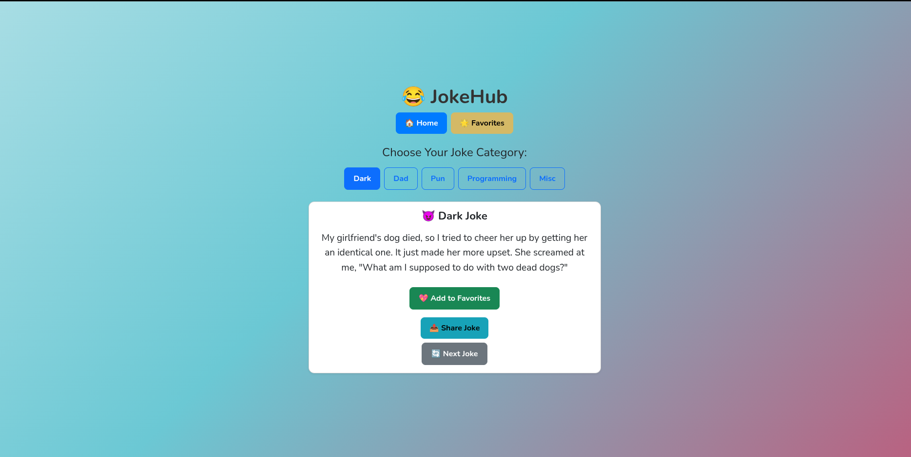

# 😂 JokeHub

**JokeHub** is a playful, responsive React + TypeScript app that delivers hilariously curated jokes across dark humor, dad jokes, puns, and programming laughs — complete with favorites, sharing, and stylish punchline delivery.

---

## 🌟 Features

- 🎭 Browse jokes by category: **Dark**, **Dad**, **Pun**, **Programming**, **Misc**
- ⚡ Instant joke fetching using:
  - [JokeAPI](https://jokeapi.dev/)
  - [icanhazdadjoke.com](https://icanhazdadjoke.com/)
- 💾 Save favorite jokes to your local collection
- 🔁 Tap into unlimited laughter with the "Next Joke" button
- 📤 Share jokes using Web Share API or clipboard copy
- 💅 Smooth hover effects and emoji-based category styling
- 💻 Fully responsive design powered by Bootstrap

---

## 📸 Preview



---

## 🧱 Tech Stack

| Tool | Usage |
|------|-------|
| React + TypeScript | Core frontend logic |
| Vite | Lightning-fast build setup |
| Bootstrap | Responsive styling |
| JokeAPI & Dad Joke API | Joke content sourcing |
| localStorage | Persistent favorites |

---

## 🚀 Installation

> Recommended: [Node.js](https://nodejs.org/) + [Yarn](https://yarnpkg.com/) installed


```
git clone https://github.com/Zambagarrah/Joke-Hub.git 
cd Joke-Hub 
yarn install 
yarn dev 
```
Then head to `http://localhost:5173` and start laughing.

## 🧃 Contributing
Want to add your own category? 
Improve the UI? 
Toss in joke ratings or analytics? 
Pull requests are welcome!

```
# Create a new feature branch
git checkout -b feat/my-awesome-idea

# Make your changes, then push
git push origin feat/my-awesome-idea
```

